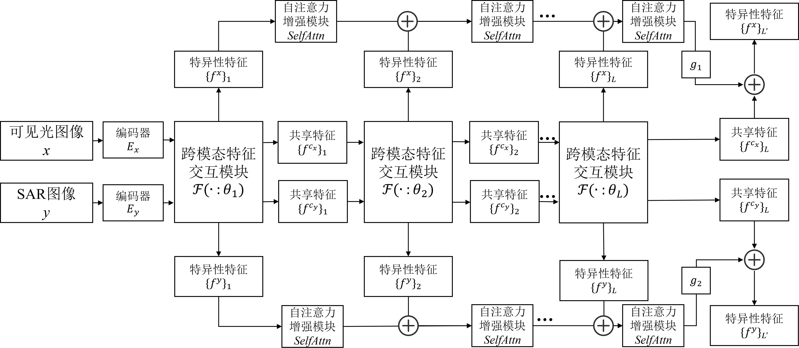
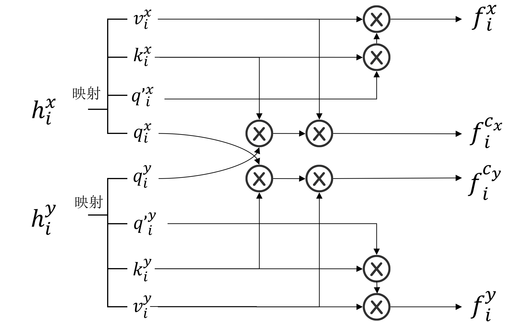
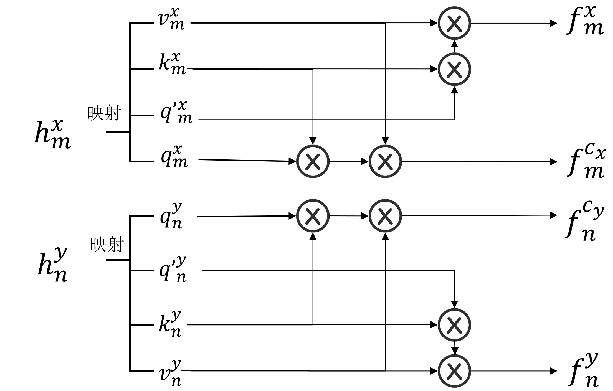
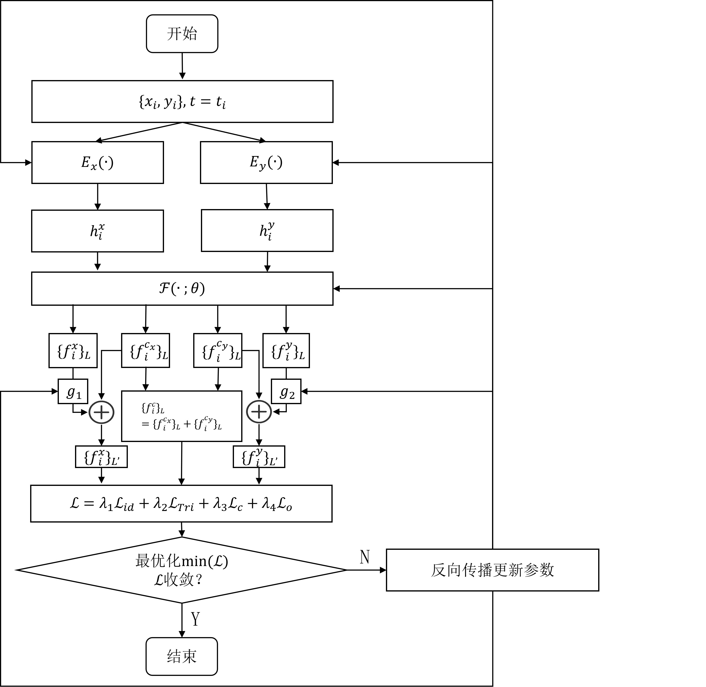
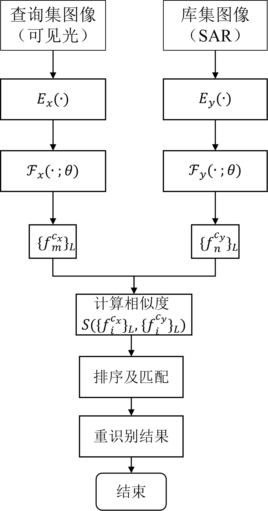
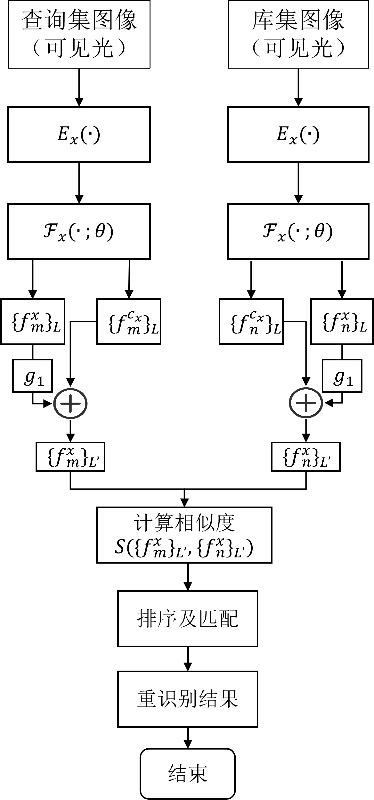

# ShipReID

## 一种用于可见光-SAR多模态图像舰船重识别的联合特征学习算法

通过构建统一的联合特征学习网络，本发明在多层次跨模态特征交互时，解耦跨模态共享特征与模态特异性特征，对同一框架下跨模态一致性与模态内判别性的协同优化，并针对跨模态与同模态重识别的不同任务需求对特征表示进行自适应建模，使得联合特征学习网络能够在同模态与跨模态重识别任务中复用同一特征提取框架，从而实现了舰船目标在同模态或跨模态场景下的有效重识别应用。

## 运行方法：

将数据放在todataset中

训练时直接运行train.py即可

测试时直接运行test.py即可

参数存放于config文件夹中

## 网络结构

## 训练时跨模态特征交互模块中的注意力机制

## 推理时跨模态特征交互模块中的注意力机制

## 训练流程

## 推理流程

